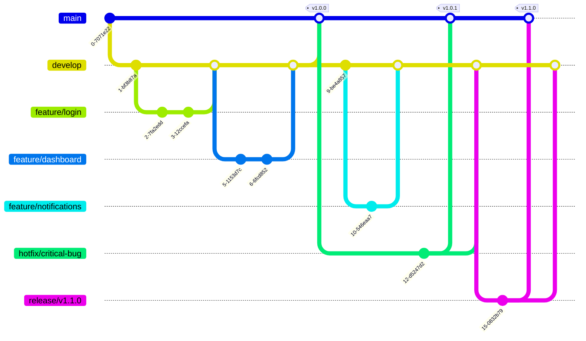

# Bot Manager

## Introduction

This template provides a complete setup for a Next.js application. It's designed to help you quickly start a new project with modern technologies and an optimized project structure.

### System Requirements
- Node: >= 18.16.0
- NPM or Yarn

### Core Technology Versions
- Next.js: v14.2.14
- React: v18
- TypeScript: v5

## Installation and Running the Project

### Installing Dependencies

Use [npm](https://www.npmjs.com/) to install packages.

```bash
npm install

# Set up Husky for development environment
npm run prepare
```

### Running the Project in Development Mode

```bash
# Start development server
npm run dev
```

The application will run at the default address: http://localhost:3000

### Building the Project for Production

```bash
# Build for production
npm run build
```

Build results will be saved in the `.next/` directory.

### Running the Project in Production Mode (after building)

```bash
# Start production server
npm run start
```

### Checking and Fixing Coding Conventions

```bash
# Check ESLint errors
npm run lint
```

## Technologies Used

### Core
- **Next.js 14**: React framework with server-side rendering, routing, and optimization features
- **React 18**: Modern UI library with new features like Concurrent Mode, Suspense, and improved hooks
- **TypeScript**: Static type support, helping to detect errors early and improve development experience

### State and Data Management
- **[React Query](https://tanstack.com/query/latest/docs/react/overview)**: Server-state management library, providing hooks for fetching, caching, and updating data
- **[Axios](https://axios-http.com/)**: Promise-based HTTP client for making API requests

### Internationalization
- **[Next-intl](https://next-intl-docs.vercel.app/)**: Internationalization (i18n) solution for Next.js, supporting multiple languages

### UI and Styling
- **[Material UI](https://mui.com/)**: React UI framework with Material Design components
- **[TailwindCSS](https://tailwindcss.com/)**: Utility-first CSS framework, helping to build UI quickly and consistently
- **[Emotion](https://emotion.sh/)**: CSS-in-JS library for styling components

### Forms and Validation
- **[React Hook Form](https://react-hook-form.com/)**: Efficient form management library with high performance and minimal re-renders
- **[Yup](https://github.com/jquense/yup)**: Schema validation library, integrates well with React Hook Form

### Notifications
- **[React Toastify](https://fkhadra.github.io/react-toastify/)**: Toast notification library for React applications

### Development Tools
- **[ESLint](https://eslint.org/)**: Linting tool to detect and fix errors in JavaScript/TypeScript code
- **[Prettier](https://prettier.io/)**: Automatic code formatter, ensuring consistent code style
- **[Husky](https://typicode.github.io/husky/)**: Git hooks manager, automatically running scripts before commit/push
- **[Commitlint](https://commitlint.js.org/#/)**: Checks commit messages format according to conventions

## Project Structure

```bash
.
├── .husky                     # Husky configuration for Git hooks
├── .next                      # Next.js build output
├── public                     # Static resources, not processed by bundler
├── app                        # Next.js App Router structure
│   ├── [locale]               # Locale-specific routes
│   │   ├── layout.tsx         # Root layout component
│   │   ├── page.tsx           # Home page component
│   │   └── ...                # Other pages and layouts
├── components                 # Reusable components
│   ├── common                 # Common components (Button, Input, Modal...)
│   └── features               # Feature-specific components
├── lib                        # Utility libraries and configurations
│   ├── api                    # API declarations and configurations
│   │   ├── axiosClient.ts     # Axios client configuration
│   │   └── endpoints          # API endpoints by module
├── hooks                      # Custom React hooks
├── contexts                   # React contexts for state management
├── types                      # TypeScript types/interfaces definitions
├── utils                      # Utility functions
├── messages                   # Internationalization messages
│   ├── en.json
│   ├── vi.json
│   └── ...
├── styles                     # Global styles and theme configuration
├── .eslintrc.json            # ESLint configuration
├── .gitignore                # Git ignore configuration
├── .prettierrc               # Prettier configuration
├── commitlint.config.js      # Commitlint configuration
├── next.config.js            # Next.js configuration
├── tailwind.config.js        # TailwindCSS configuration
├── tsconfig.json             # TypeScript configuration
└── package.json              # Project dependencies and scripts
```

## Commit Conventions

This project uses Commitlint to ensure commit messages follow the [Conventional Commits](https://www.conventionalcommits.org/) specification:

```
<type>[optional scope]: <description>

[optional body]

[optional footer(s)]
```

Common types:
- **feat**: Add a new feature
- **fix**: Fix a bug
- **docs**: Documentation changes
- **style**: Changes that do not affect code (formatting, semicolons...)
- **refactor**: Code refactoring
- **test**: Adding or fixing tests
- **chore**: Changes to the build process, tools...

Examples:
```
feat(auth): implement login functionality
fix(api): handle network errors in axios client
```

## Contribution Guidelines

1. Fork the project
2. Create a feature branch (`git checkout -b feature/amazing-feature`)
3. Commit your changes (`git commit -m 'feat: add some amazing feature'`)
4. Push to the branch (`git push origin feature/amazing-feature`)
5. Create a Pull Request

## License

This project is distributed under the MIT License. See the `LICENSE` file for more details.

## Contact

If you have any questions or suggestions, please create an issue in the repository or contact the project maintainer.

## Git Flow

This project follows a simplified Git flow workflow to maintain code quality and streamline the development process.



### Branches

- **main**: Production code. Only merged from release branches or hotfixes.
- **develop**: Integration branch where features are combined and tested.
- **feature/\***: Individual feature branches created from develop.
- **hotfix/\***: Emergency fixes for production issues, branched from main.
- **release/\***: Preparation for a new production release, branched from develop.

### Workflow

1. **Feature Development**
   - Create a feature branch from develop: `git checkout -b feature/new-feature develop`
   - Develop the feature with regular commits
   - When complete, create a PR to merge back into develop

2. **Release Preparation**
   - Create a release branch when develop is ready for release: `git checkout -b release/v1.0.0 develop`
   - Make only bug fixes and documentation updates in this branch
   - When ready, merge to both main and develop: 
     ```
     git checkout main
     git merge --no-ff release/v1.0.0
     git tag -a v1.0.0
     git checkout develop
     git merge --no-ff release/v1.0.0
     ```

3. **Hotfixes**
   - For critical production bugs, create a hotfix branch from main: `git checkout -b hotfix/critical-bug main`
   - Fix the issue
   - Merge back to both main and develop:
     ```
     git checkout main
     git merge --no-ff hotfix/critical-bug
     git tag -a v1.0.1
     git checkout develop
     git merge --no-ff hotfix/critical-bug
     ```

This workflow helps maintain a clean repository history and provides a structured approach to development, testing, and releases.